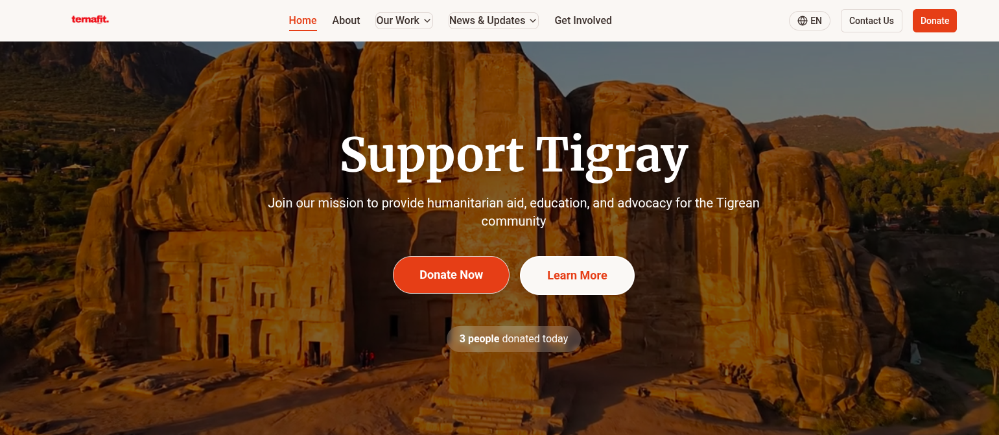

# Ternafit



## 🌍 About Ternafit

Ternafit is a platform dedicated to raising awareness about the Tigray region, sharing stories of resilience, and providing updates on recovery efforts. Our mission is to amplify Tigrean voices and support the community through information and advocacy.

## 🚀 Features

- **Podcast Series**: Engaging audio content featuring stories, interviews, and discussions about Tigray
- **Multilingual Support**: Content available in English and Swedish
- **Responsive Design**: Works on all devices
- **Modern Tech Stack**: Built with the latest web technologies

## 🛠️ Technologies Used

- **Frontend**:
  - React 18 with TypeScript
  - Vite for fast development
  - shadcn/ui components
  - Tailwind CSS for styling
  - React Router for navigation
  - Lucide Icons

- **Hosting & Storage**:
  - Netlify for web hosting
  - AWS S3 for media storage

## 🚀 Getting Started

### Prerequisites

- Node.js (v16 or later)
- npm (v8 or later) or yarn

### Installation

1. **Clone the repository**

   ```sh
   git clone https://github.com/yosephdev/ternafit.git
   cd ternafit
   ```

2. **Install dependencies**

   ```sh
   npm install
   # or
   yarn
   ```

3. **Start the development server**

   ```sh
   npm run dev
   # or
   yarn dev
   ```

4. **Open in your browser**
   The app should be running at `http://localhost:5173`

## 📂 Project & Asset Structure

```
public/images/
├── blog/            # Blog-related images
├── documentation/   # Conflict documentation images
├── education-group.webp
├── figures/         # Historical figures
├── hero/            # Hero section images
├── logos/           # All logo and branding images
├── news/            # News section images
├── podcast/         # Podcast episode images
├── projects/        # Project and work area images
├── stories/         # Story/testimonial content
├── team/            # Team member photos
├── testimonials/    # User testimonials
├── ...other assets
```

Other documents (PDF, PNG) are also stored in `public/images/` and its subfolders for clarity.

## ✅ Public Audit & Inspection Checklist

Before making the repository public, please:
- [ ] Ensure all images are in the correct subfolder (see structure above)
- [ ] Place all PDF and certificate files in `public/images/` or a relevant subfolder
- [ ] Remove any sensitive or private files
- [ ] Verify that all referenced images in code match their actual location
- [ ] Check that the preview image in README is visible
- [ ] Review for copyright or privacy issues

## 🌐 Deployment

The application is deployed on Netlify. To deploy your changes:

1. Push your changes to the `main` branch
2. Netlify will automatically trigger a new deployment

## 📝 License

This project is licensed under the MIT License - see the [LICENSE](LICENSE) file for details.

## 🤝 Contributing

We welcome contributions! Please read our [Contributing Guide](CONTRIBUTING.md) for details on our code of conduct and the process for submitting pull requests.

## 📞 Contact

For inquiries, please contact us at [info@ternafit.org](mailto:info@ternafit.org)

---

Made with ❤️ for Tigray
